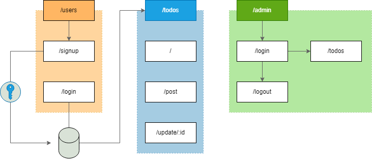

# Todo-API

Sistema de cadastro de usuários e armazenamento de tarefas utilizando Express e MySql.

## Instalação

- Tenha o [Node.js](https://nodejs.dev/) instalado em seu computador.

- Faça o clone do repositório atráves do terminal do [Git](https://git-scm.com/downloads).

```
$ git clone https://github.com/C836/Todo-API
```
- Inicie a conexão com o Mysql e crie o banco de dados
```
$ mysql -u root -p

$ CREATE DATABASE todos;
```

- Navegue pelos arquivos até a raiz da aplicação, instale as dependências necessárias e inicie o projeto.

```
$ npm install
$ npm start
```

---

Altere as chaves e senhas de Admin atráves do arquivo ".env" localizado na raiz do projeto.

<details>
<summary>Exemplo</summary>

```

ACCESS_TOKEN_SECRET = 0ede4e03bb4b70673edc...
ADMIN_TOKEN_SECRET = 445D8F466ABA5E6E673C...


PASSWORDHASH = AE548942A...


HOST = localhost
PORT = 3306
USER = root
PASSWORD = senha
DATABASE = todos


ADMIN_EMAIL = EMAILSECRETO@MAIL.COM
ADMIN_PASS = SENHASECRETA918
```

</details>

## Rotas

* Status

    - -1 : Atrasado :exclamation:
    - 0 : Inconcluído :clock3:
    - 1 : Concluido :heavy_check_mark:


### /users/ - Autenticação

<code>POST</code> - Cadastrar usuário no banco de dados

<code>http://localhost:3010</code> <code>/users</code> <code>/signup</code>
```

{
    "email":"user@mail.com",
    "senha":"123abc"
}
```

---

<code>POST</code> - Autenticar e gerar Token

<code>http://localhost:3010</code> <code>/users</code> <code>/login</code>

```
{
    "auth": true,
    "token": "eyJhbGciOiJIUzI1NiIsInR5cCI6..."
}
```

### /todos/ - Tarefas

Utilize o token fornecido no login como parâmetro com a chave [x-access-token]

<code>POST</code> - Inserir nova tarefa
<code>http://localhost:3010</code> <code>/todos</code> <code>/new</code> <code>?x-access-token=x</code>

```
{
    "descricao": "Aprender Java",
    "prazo": "10/10/2022"
}
```

(Todas as tarefas recebem status 0 por padrão)

---

<code>POST</code> - Exibir tarefas do usuário

<code>http://localhost:3010</code> <code>/todos</code> <code>?x-access-token=x</code>

```

[
    {
        "userId": "70d5f35d-5f2b-451b-97e2-af4789dc4c8b",
        "todoId": 1,
        "status": 0,
        "criado": "2022-06-04 14:20:10",
        "atualizado": "2022-06-04 16:20:10",
        "prazo": "2022-11-10",
        "descricao": "Aprender Java"
    }
]
```

---

<code>PATCH</code> - Atualizar uma tarefa

<code>http://localhost:3010</code> <code>/todos</code> <code>/update</code> <code>/:id</code> <code>?x-access-token=x</code>
```

{
    "descricao": "Aprender Python",
    "prazo": "20/11/2022",
    "status": "1"
}
```

### /admin/ - Rotas de administrador

<code>POST</code> - Autenticar e gerar Token

<code>http://localhost:3010</code> <code>/admin</code> <code>/login</code>

A rota de admin compara a requisição diretamente com os dados do arquivo .env e geram um token exclusivo como chave de acesso

```

{
    "email":"EMAILSECRETO@MAIL.COM",
    "senha":"SENHASECRETA918"
}
```

---

<code>GET</code> - Exibe as tarefas de todos os usuários. (Permite filtragem por status e paginação)</br>
<code>http://localhost:3010</code> <code>/admin/todos/</code> <code>:pagina</code> <code>?status=x</code> <code>?x-access-token=x</code>

```
[
    {
        "userId": "70d5f35d-5f2b-451b-97e2-af4789dc4c8b",
        "todoId": 1,
        "status": 0,
        "criado": "2022-06-04",
        "atualizado": null,
        "prazo": "2020-11-10",
        "descricao": "Aprender Java"
    }
]
```
## Diagrama de conexões

